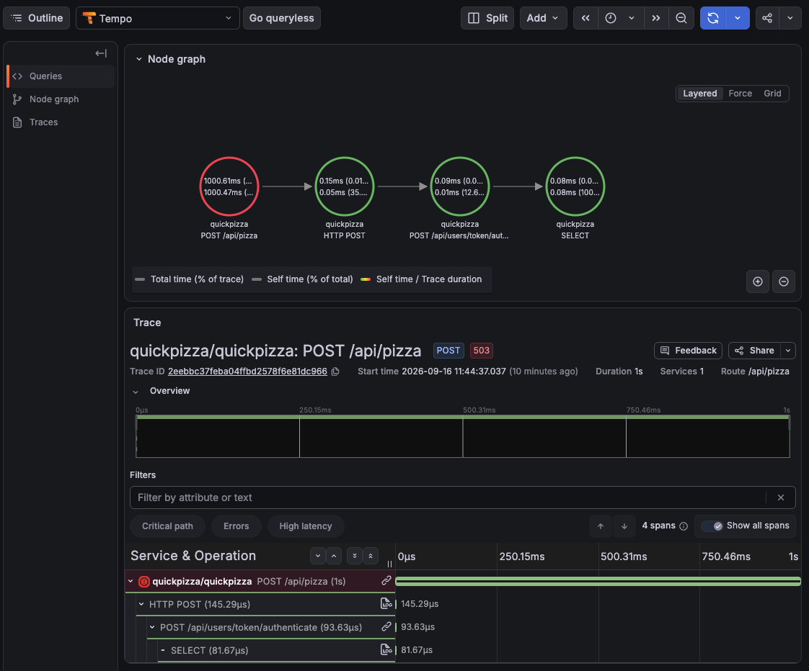
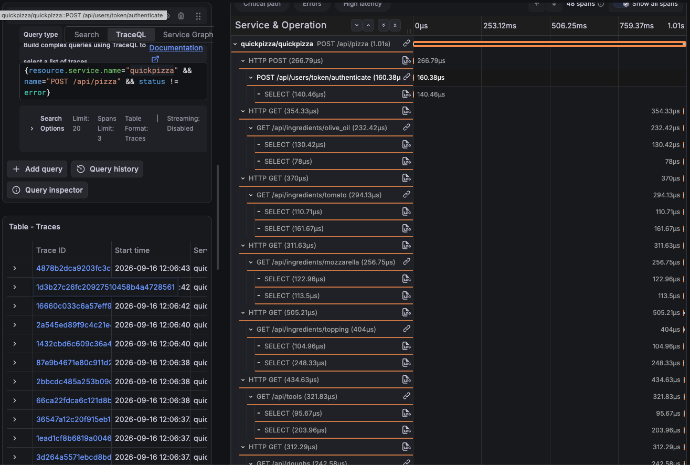

# Observe the system under test with Grafana

_**Need help?** Raise your hand and we'll come help._

So far, a test told you pass or fail: a threshold breached, a check failed, an error rate went up. That's enough to know something changed. It's not enough to know why, and you don't need to already know QuickPizza's internals to find out. Metrics, logs, and traces each answer a different question, and Grafana's Drilldown apps let you follow the trail from one to the next without writing a query up front.

## Part 1: Inject a failure, then go find it

### Turn on failure injection

Uncomment these two lines under the `quickpizza` service in [`compose.yaml`](../compose.yaml). Same failure-injection technique as [lab 4](../04.assertions/), used here for a different reason: not to test a threshold, but to have something real to go find.

```yaml
QUICKPIZZA_DELAY_RECOMMENDATIONS: "1s"
QUICKPIZZA_FAIL_RATE_RECOMMENDATIONS_API_PIZZA_POST: 5
```

`5` is an integer percentage, a 1-in-20 chance that `POST /api/pizza` fails outright. `QUICKPIZZA_DELAY_RECOMMENDATIONS` (no `_POST` suffix) adds a flat 1-second delay to every request on the recommendations endpoints, failing or not. Restart QuickPizza to pick up the change:

```bash
docker compose up -d quickpizza
```

### Generate at least 2 minutes of load

Reuse [lab 8](../08.test-result-visualization/)'s `k6-test.js`. It already posts to `/api/pizza`, the endpoint you just tampered with. Send results to Prometheus so there's something to look at:

```bash
K6_PROMETHEUS_RW_TREND_AS_NATIVE_HISTOGRAM=true k6 run --out experimental-prometheus-rw --tag testid=sut-check-1 --vus 10 --duration 2m 08.test-result-visualization/k6-test.js
```

From the test's own summary, you already know something's off: `checks_failed` sitting around 4-5%, average latency jumping to ~1.1s. That's the extent of what a test tells you on its own. Everything from here is about finding out why, in Grafana, not by guessing.

### Metrics: confirm it, in aggregate

Open **Grafana → Drilldown → Metrics** and look for `k6_http_req_failed_rate` (or reuse the **k6 Prometheus** dashboard from lab 8). You don't need a PromQL query to get there; Drilldown lets you browse and filter first. The error rate sits around 4-5% for exactly the window your test ran, and `http_req_duration` is noticeably higher than usual.

That confirms something is wrong, and roughly when. It doesn't tell you why. A metric is an aggregate; it has no message and no narrative.

### Logs: find the actual failure

Open **Grafana → Drilldown → Logs**, pick the `quickpizza` service, and filter to `level="error"` around that same time window (or use the **QuickPizza Logs** dashboard). Lines like this show up:

```json
{"time":"...","level":"ERROR","msg":"Simulated random failure: Pizza service temporarily unavailable","traceID":"0ea1d69252e53e465bdb5f592396411c"}
```

Now you have the actual error message, plus something a metric never gives you: a `traceID` sitting right there in the log line, pointing at the exact request that failed.

### Traces: prove it's the same request

Copy that `traceID` into **Explore**, pick the **Tempo** datasource, and look it up directly. This is a case where jumping straight to Explore beats Drilldown: you already know exactly what you're looking for. The full request breaks into spans, and the trace itself is tagged `503`:



```
POST /api/users/token/authenticate     94μs
HTTP POST (internal call)              145μs
POST /api/pizza                        1.00s   ← STATUS_CODE_ERROR
SELECT (database query)                82μs
```

The `POST /api/pizza` span is marked as an error and lasts almost exactly 1 second: the same request, carrying both symptoms you saw separately in metrics (the latency) and logs (the failure), now anchored to one concrete example instead of a percentage. The other spans rule out the auth check and the database query. The time and the failure both belong to the pizza-recommendation call itself.

This trace only has 4 spans. Look at QuickPizza's own code and you'll see why: it returns the error immediately, before ever calling the catalog or copy services that would normally build the recommendation. The rest of the request never happens.

### Find the same request without the error

To see what a `POST /api/pizza` request looks like when it doesn't bail out early, search instead of looking up a single ID. In Explore, switch the Tempo query to **Search** (or use the **Traces** Drilldown app) and use this TraceQL:

```
{resource.service.name="quickpizza" && name="POST /api/pizza" && status != error}
```

Reach for `status != error`, not `status = ok`. Most spans that succeed are never explicitly marked `ok` — they're left `unset` (that's just how OpenTelemetry instrumentation usually works: libraries mark failures explicitly and leave success alone). `status != error` catches both `unset` and `ok`.

Open one of the results:



Same endpoint, same 1-second delay, but 48 spans instead of 4: the auth check, the internal recommendation call, name and pizza generation, a handful of database reads and writes, and a lookup for every ingredient, tool, and dough. This is the request when nothing cuts it short: the system doing its actual job, not just failing.

Metrics told you something's wrong, in aggregate. Logs gave you the words. Tracing proved it's the same request end to end, and showed you everything the failure hid.

### Drilldown: when you know the service, not the query

Drilldown (Metrics, Logs, and Traces apps, all installed in this stack) helps when you know what you're looking for, a service, a component, a kind of data, but not the exact PromQL/LogQL/TraceQL to get it. Open **Drilldown → Metrics** and there are two ways in, side by side:

- **Search by name.** The search box filters the metric catalog as you type. Type `k6_` and it narrows straight to `k6_http_reqs_total`, `k6_http_req_failed_rate`, and the rest, each with a live preview.
- **Filter by label.** Click **+ label = value** and pick a label like `service_name=quickpizza`, then a value. The catalog narrows to just what that service exposes.

For Postgres, both work: filter `service_name = quickpizza-db`, or search by name (`pg_stat`) and land on `pg_stat_statements_calls_total`, `pg_stat_statements_seconds_total`, `pg_stat_activity_count`, and similar. Alloy's own Postgres exporter labels everything it scrapes with `service_name`, so the label-based path works here even though it didn't for k6.

Same app, two different telemetry pipelines, two different discovery paths. Knowing how a signal reaches Prometheus tells you which Drilldown shortcut will actually work.

Once Drilldown gets you to something specific, a `traceID` from a log line, an exact metric plus label combination, switch to **Explore** with the matching datasource and query it directly. That's faster than browsing once you already know what you're asking for.

### Ask Grafana Assistant to investigate

Everything so far, metrics then logs then traces, was you deciding what to look at next. [Grafana Assistant](http://localhost:3000/plugins/grafana-assistant-app) can run that same investigation itself: given a symptom, it queries the right datasources, compares a failing trace against a successful one, and comes back with a root cause.

> In the quickpizza service, Pizza requests have been failing with 503 errors and higher latency over the last 15 minutes. Investigate the root cause. 

Assistant works through this the same way you just did by hand: it checks `quickpizza_server_http_requests_total` and the request-duration histogram in Prometheus to confirm the error and latency pattern, pulls matching logs and traces from Loki and Tempo, and diagrams the request flow it found in `POST /api/pizza`. It lands on essentially the same finding, an unattributed gap of about a second inside the pizza/name-generation step right before the 503s, without ever claiming to know why that gap exists.

Drilldown and Explore get you to the evidence. Assistant assembles it into a story faster than you could by hand, but it's still a story built on the same metrics, logs, and traces you already know how to check yourself.

### Go further: connect the QuickPizza codebase

Assistant's finding stops at "an unattributed gap." That's the limit of what telemetry alone can say: a hypothesis about the code, made without ever seeing the code. Give it a way in and it can read the code directly. Open **Assistant → Settings**, search for "GitHub", and install the GitHub MCP server, scoped to the `grafana/quickpizza` repository.

With that connected, ask Assistant to go from symptom to source:

> Using the GitHub MCP server, look at the `grafana/quickpizza` source code and explain what in the code causes the ~1s gap and the 503s in `POST /api/pizza`.

Telemetry narrowed the search to one handler and one roughly 1-second window. The codebase confirms why.

## Related Resources

- [Grafana Documentation: Metrics Drilldown](https://grafana.com/docs/grafana/latest/visualizations/simplified-exploration/metrics/)
- [Grafana Documentation: Logs Drilldown](https://grafana.com/docs/grafana/latest/visualizations/simplified-exploration/logs/)
- [Grafana Documentation: Traces Drilldown](https://grafana.com/docs/grafana/latest/visualizations/simplified-exploration/traces/)
- [Grafana Documentation: Explore](https://grafana.com/docs/grafana/latest/visualizations/explore/)
- [Grafana Assistant Documentation: Enable Assistant in Grafana OSS](https://grafana.com/docs/grafana-cloud/machine-learning/assistant/get-started/self-managed/) (requires a Free Grafana Cloud account).

---

[← Previous exercise](../08.test-result-visualization/) · [Workshop homepage](https://github.com/grafana/testcon-2026-k6-workshop) · [Next exercise →](../10.testing-beyond-http/)
