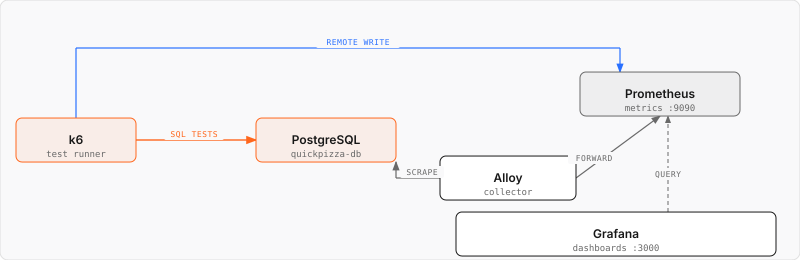
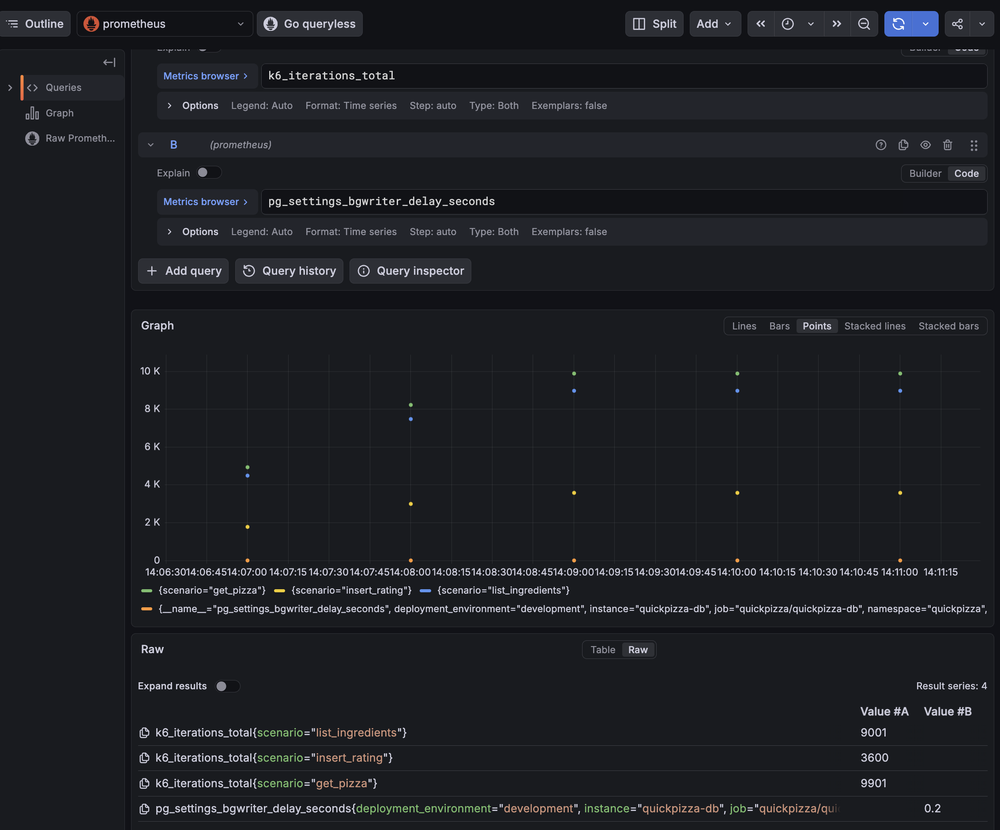
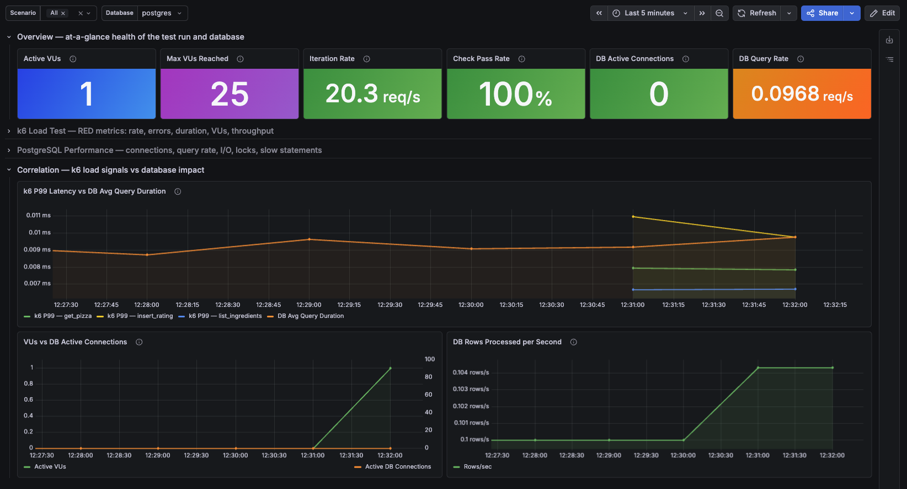

# Testing beyond HTTP

_**Need help?** Raise your hand and we'll come help._

Every test so far has sent HTTP requests. Real systems have more surface than that: QuickPizza also talks over WebSocket, and stores everything directly in PostgreSQL. This lab covers three more k6 techniques: load testing a WebSocket connection, load testing a database directly, and reporting a custom metric for something neither one gives you for free. It closes the way [lab 8](../8.test-result-visualization/) did, with Grafana Assistant building a dashboard for the results.

## Part 1: Load test a WebSocket connection

QuickPizza's homepage shows a live counter of pizzas other visitors are generating right now. Every time someone gets a recommendation, the frontend sends `{ws_visitor_id, msg: "new_pizza"}` over `/ws`, and the server broadcasts it back to every connected client, including the sender.

That broadcast round trip is what we're testing the performance of here: how long it takes an event to travel from one visitor, through the server, back out to a listening client, and whether that holds up as more visitors stay connected at once.

We recommend [`k6/websockets`](https://grafana.com/docs/k6/latest/javascript-api/k6-websockets/) for new scripts. It ships in k6 itself, no extension needed, and implements the standard [WebSocket API](https://websockets.spec.whatwg.org/) instead of the older callback-style `k6/ws` module.

Run [`ws-test.js`](./ws-test.js):

```bash
K6_PROMETHEUS_RW_TREND_AS_NATIVE_HISTOGRAM=true k6 run --out experimental-prometheus-rw ws-test.js
```

Each iteration connects, sends one `new_pizza` event tagged with a unique visitor ID, pings the connection, and checks that both come back before disconnecting:

```js
check(receivedOwnBroadcast, { "broadcast came back": (v) => v });
check(receivedPong, { "ping replied with pong": (v) => v });
```

Both checks should pass 100% of the time. `ws-test.js` has comments explaining the trickier parts: why the broadcast check has to filter by visitor ID, why closing on the first signal instead of both would race, why an uncleared timer would pad out the iteration.

One result is worth clarifying before you look at it: `iteration_duration` sits around 1 second, even though the actual round trip (connect, send and ping, receive the broadcast and the pong, close) only takes a few milliseconds. Each iteration's `sleep(1)` runs first and blocks for a full second before the socket even opens. WebSocket calls are async callbacks, so k6 runs the synchronous `sleep()` immediately and only afterward works through `open`, `message`, `pong`, and `close`. The iteration finishes once that final `close` fires with nothing left scheduled, so sleep happens first, but closing the connection is what actually ends the iteration.

k6's built-in WebSocket metrics land in Prometheus the same way HTTP ones do: `k6_ws_sessions_total`, `k6_ws_msgs_sent_total`, `k6_ws_msgs_received_total`, `k6_ws_connecting`, `k6_ws_session_duration`, `k6_ws_ping`. Query them in **Explore** or **Drilldown → Metrics** exactly like `k6_http_req_duration` in [lab 8](../8.test-result-visualization/).

### Try it yourself

The intro asked whether the broadcast holds up as more visitors stay connected at once. Note the `ws_ping` numbers from your first run, then bump `vus` in `ws-test.js` from `20` to `100` and run it again:

```bash
K6_PROMETHEUS_RW_TREND_AS_NATIVE_HISTOGRAM=true k6 run --out experimental-prometheus-rw ws-test.js
```

Both checks should still pass 100% of the time. Compare `k6_ws_ping` latency between runs: that's the server's actual responsiveness under load, not just a message count.

## Part 2: Load test a database directly

The following architecture diagram shows the data flow for this part: k6 talks to PostgreSQL directly, while Alloy scrapes `pg_stat_statements` for the database's own view of the same load.



-----

Open [`sql-db-k6-test.js`](./sql-db-k6-test.js) and review how it uses the [`k6/x/sql`](https://github.com/grafana/xk6-sql) extension to interact with PostgreSQL directly, skipping QuickPizza's HTTP layer entirely.

This test runs three scenarios with different workload patterns:
- **Read-heavy**: list ingredients
- **Read**: random pizza lookup
- **Write**: insert a rating for a random seeded pizza

The `setup()` function prepares the test data and runs before the scenarios start.

The `teardown()` function runs after the test completes and returns the database to its initial state.

Run the test with the `--out experimental-prometheus-rw` option to send k6 results to Prometheus.

```bash
K6_PROMETHEUS_RW_TREND_AS_NATIVE_HISTOGRAM=true k6 run --out experimental-prometheus-rw sql-db-k6-test.js
```

This test generates database traffic, not HTTP traffic, so the metrics worth looking at in Explore or Drilldown Metrics are different: PostgreSQL's own (`pg_stat_statements_*`) alongside k6's [built-in metrics](https://grafana.com/docs/k6/latest/using-k6/metrics/reference/) for this run, `iterations`, `checks`, and the three scenario names.



## Part 3: Report what an extension doesn't: a custom metric

`http.post()` automatically reports `http_req_duration`. `db.query()` and `db.exec()` don't have an equivalent; `k6/x/sql` returns rows, not timing. If you want to know how long a query took, measure and report it yourself with a [custom metric](https://grafana.com/docs/k6/latest/using-k6/metrics/create-custom-metrics/).

Back in `sql-db-k6-test.js`, add a [`Trend`](https://grafana.com/docs/k6/latest/javascript-api/k6-metrics/trend/) metric and wrap each of the three query calls with it, tagging every value with which query it timed:

```js
import { Trend } from "k6/metrics";

// xk6-sql doesn't report query timing the way http auto-reports http_req_duration,
// so this custom Trend fills that gap. `true` marks it as a time value (ms).
const dbQueryDuration = new Trend("db_query_duration", true);

export function listIngredients() {
  const start = Date.now();
  const rows = db.query("SELECT id, name, vegetarian FROM ingredients ORDER BY id;");
  dbQueryDuration.add(Date.now() - start, { query: "list_ingredients" });
  check([...rows], { "got ingredients": (r) => r.length > 0 });
}
```

Do the same for `getPizza` and `insertRating`, each tagging the metric with its own `query` value.

Run the same command as Part 2 again. `db_query_duration` now shows up in the terminal summary under **CUSTOM**, right alongside k6's own built-in metrics. Sent to Prometheus, it becomes `k6_db_query_duration_p99` (and every other percentile you ask for), broken out by the `query` tag:

```promql
k6_db_query_duration_p99{query="get_pizza"}
```

A custom metric behaves exactly like a built-in one everywhere downstream: same terminal summary, same Prometheus series naming, same tags. The only extra work is the two lines that create it and add a value. k6, and Grafana, don't care whether a metric shipped with k6 or came from your own script.

## Part 4: Build a dashboard with Grafana Assistant

If you have time, try building a dashboard that correlates k6 load test results with PostgreSQL performance. This test generates database traffic instead of HTTP traffic, so the prebuilt k6 dashboards from earlier labs don't cover it.

Here's a basic starting prompt for [Grafana Assistant](http://localhost:3000/plugins/grafana-assistant-app). Edit it to ask for whatever you actually want to see:

> Create a dashboard that correlates k6 load test results with PostgreSQL performance metrics collected through pg_stat_statements.
>
> Use the k6 Prometheus Dashboard as a reference.
>
> Include the k6 RED metrics like latency, error rate, request rate, VUs, and PostgreSQL performance metrics.
>
> The goal is to detect how the workload can affect DB bottlenecks and slow responses.

Here's an example of what that produces:



- Which scenario generates the most database activity?
- Do any failures or database locks occur?
- How do query latency and throughput change during the test?

Finally, edit any panel to explore the underlying k6 and `pg_stat_statements` metrics and queries, including the `db_query_duration` custom metric from Part 3 if you add it to a panel yourself.

## Related Resources

- [k6 Documentation: WebSockets](https://grafana.com/docs/k6/latest/javascript-api/k6-websockets/)
- [k6 Documentation: Create custom metrics](https://grafana.com/docs/k6/latest/using-k6/metrics/create-custom-metrics/)
- [github.com/grafana/xk6-sql](https://github.com/grafana/xk6-sql)
- [k6 Documentation: Test lifecycle](https://grafana.com/docs/k6/latest/using-k6/test-lifecycle/)
- [k6 Documentation: Built-in metrics](https://grafana.com/docs/k6/latest/using-k6/metrics/reference/)
- [k6 Documentation: Send k6 results to Prometheus](https://grafana.com/docs/k6/latest/results-output/real-time/prometheus-remote-write/)
- [Grafana Assistant Documentation: Enable Assistant in Grafana OSS](https://grafana.com/docs/grafana-cloud/machine-learning/assistant/get-started/self-managed/) (requires a Free Grafana Cloud account).

---

[← Previous exercise](../9.observing-the-sut/) · [Workshop homepage](https://github.com/grafana/testcon-2026-k6-workshop) · [Next exercise →](../11.hybrid-performance-testing/)
