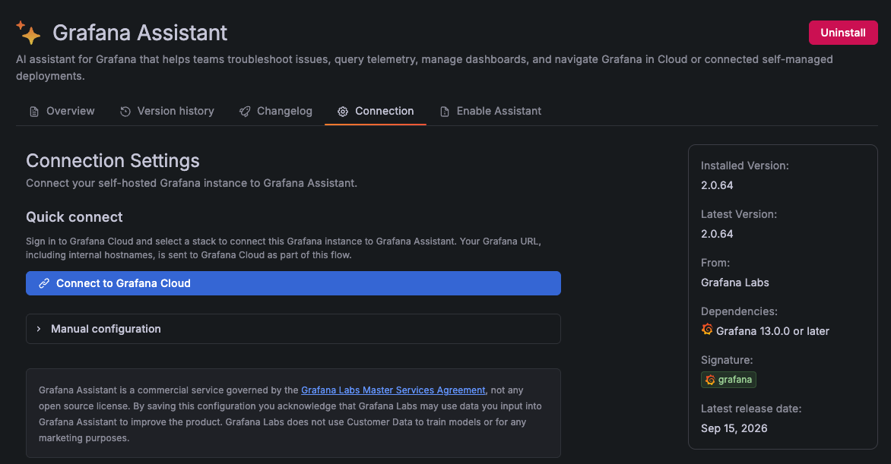

# Store and visualize test results

_**Need help?** Raise your hand and we'll come help._

So far, you've read every result from k6's own terminal summary, printed once the run finishes. That works for a quick check, but it doesn't scale: you can't watch a long test progress live, compare today's run against last week's, or hand a result to a teammate who wasn't staring at your terminal when it ran.

## Send results to a time-series backend

k6 can stream every metric to an external backend as the test runs, instead of only summarizing at the end. This repo's Grafana stack already includes a Prometheus instance configured to receive them.

Run [`k6-test.js`](./k6-test.js) with the `--out experimental-prometheus-rw` option, and `K6_PROMETHEUS_RW_TREND_AS_NATIVE_HISTOGRAM=true` to send `http_req_duration` (and every other Trend metric) as a [Prometheus native histogram](https://prometheus.io/docs/specs/native_histograms/) instead of a handful of pre-picked percentiles:

```bash
K6_PROMETHEUS_RW_TREND_AS_NATIVE_HISTOGRAM=true k6 run --out experimental-prometheus-rw 8.test-result-visualization/k6-test.js
```

k6 pushes every metric (`http_req_duration`, `http_reqs`, `vus`, `checks`, all of it) to Prometheus in real time over the [Prometheus remote-write protocol](https://grafana.com/docs/k6/latest/results-output/real-time/prometheus-remote-write/), rather than holding everything until the run ends.

## Visualize with a prebuilt dashboard

This project already provisions two dashboards for exactly this:

- **[k6 Prometheus](http://localhost:3000/d/k6-prometheus/k6-prometheus)**
- **[k6 Prometheus (Native Histograms)](http://localhost:3000/d/k6-prometheus-native-histograms/k6-prometheus-native-histograms)**

Same panels, different underlying representation for `http_req_duration` and the other Trend metrics. Since you just sent native histogram data, open the **Native Histograms** dashboard.

Run the test again with the same command as above. The panels update live as k6 pushes each batch of metrics.

📌 Running the same test repeatedly reuses the same series, so runs blend together on the dashboard. Tag each run with a distinct `testid` to tell them apart, and run it 2 or 3 times, at least `--vus 50` for `--duration 30s`, enough concurrency and time for a stable, comparable picture on the dashboard:

```bash
K6_PROMETHEUS_RW_TREND_AS_NATIVE_HISTOGRAM=true k6 run --out experimental-prometheus-rw --tag testid=run-1 --vus 50 --duration 30s k6-test.js
```
```bash
K6_PROMETHEUS_RW_TREND_AS_NATIVE_HISTOGRAM=true k6 run --out experimental-prometheus-rw --tag testid=run-2 --vus 50 --duration 30s k6-test.js
```
```bash
K6_PROMETHEUS_RW_TREND_AS_NATIVE_HISTOGRAM=true k6 run --out experimental-prometheus-rw --tag testid=run-3 --vus 50 --duration 30s k6-test.js
```

The dashboard's **Test ID** dropdown supports selecting one, several, or "All". Pick two or three of your runs at once and compare them side by side on the same panels. Its **Trend Metrics Query** field takes any quantile between 0 and 1 (0.5, 0.9, 0.95, 0.99, ...); type in a few different values and watch the "HTTP Request Duration" panel change, without having to re-run the test to get that quantile in the first place.

## Common k6 performance metrics

The dashboard's panels are really just k6's built-in metrics, queried and charted. Knowing what each one means makes any k6 dashboard, this one or one you build yourself, easier to read:

- **`http_reqs`**: total number of HTTP requests k6 made. The dashboard's "HTTP requests" and "Peak RPS" panels are this, summed and rated.
- **`http_req_duration`**: how long each request took, end to end. Latency distributions are rarely symmetric (a handful of very slow requests hide behind a healthy-looking average), so the "HTTP Request Duration" panel plots a percentile (any value you type into the dashboard's **Trend Metrics Query** field, since it's a native histogram) rather than a single number.
- **`http_req_failed`**: the proportion of requests k6 considers failed (non-2xx/3xx by default). This is the exact metric [lab 4](../4.assertions/)'s threshold gates on.
- **`vus`** / **`vus_max`**: virtual users actually active vs. provisioned. Useful for spotting when a ramp-up doesn't reach the target you expected, e.g. because the target under test is rejecting connections.
- **`iterations`**: how many times the default function ran, start to finish. Compare against `http_reqs` to see how many requests each iteration makes.
- **`checks`**: pass/fail counts for every `check()` in the script, same as what you've seen printed in the terminal all along, just now over time instead of as a single end-of-run total.

## Build your own dashboard with Grafana Assistant

The prebuilt dashboard is generic. It doesn't know which metrics matter most for your test, or that you're comparing tagged runs.

In this section, we'll try [Grafana Assistant](http://localhost:3000/plugins/grafana-assistant-app) to build a new dashboard for k6 results.

Grafana Assistant needs a connection to Grafana Cloud even for a self-managed instance like this one (requires a free Grafana Cloud account, see [Enable Assistant in Grafana OSS](https://grafana.com/docs/grafana-cloud/machine-learning/assistant/get-started/self-managed/) for the full setup). Connect this instance from its [Connection settings](http://localhost:3000/plugins/grafana-assistant-app?page=connection):



Click **Connect to Grafana Cloud**, sign in, and pick a stack. That's what links this local instance to Assistant. If it's not enabled for this workshop, read through this section anyway.

Once connected, open Assistant from the toolbar in any Grafana page and prompt it with what you just learned in this lab:

> Create a dashboard that visualizes k6 load test results stored in Prometheus.
>
> Include the k6 RED metrics: request rate (`http_reqs`), error rate (`http_req_failed`), and latency (`http_req_duration`, p95), plus `vus` and `iterations`.
>
> Include a table of HTTP results per request and Checks results
> 
> Add a "Test ID" template variable backed by `label_values(testid)`, multi-select with an "All" option, so I can compare specific tagged runs (tagged via `k6 run --tag testid=...`) side by side on the same panels.
>
> The goal is to compare several load test runs at a glance, without editing dashboard queries by hand.

Compare what Assistant generates against the prebuilt **k6 Prometheus (Native Histograms)** dashboard: which panels does it keep, which does it drop, and does its `testid` variable behave the same way (multi-select, "All") as the one you used earlier in this lab?

## Query the metrics yourself

Every panel on these dashboards is just a PromQL query with a chart on top, nothing hidden. Open the **⋮** menu on any panel's header and choose **Explore** to drop into that exact query, editable, in Grafana's Explore view.

While a test is running, here are the PromQL queries behind the four numbers you'd check first on any load test.

- **Latency**: `histogram_quantile(0.95, sum by (le) (rate(k6_http_req_duration_seconds[$__rate_interval])))`. The same native histogram the "Native Histograms" dashboard queries, so you can ask for any quantile (`0.5`, `0.9`, `0.99`, ...), not just the one k6 happened to send.
- **Traffic (request rate)**: `sum(rate(k6_http_reqs_total[$__rate_interval]))`. How much demand your test is generating, in requests per second.
- **Traffic (VUs)**: `sum(k6_vus)`. The same "how much load" question, but as concurrent virtual users instead of request throughput. The two usually move together, but not always: a slow endpoint can hold VUs "busy" without moving the request rate much.
- **Error rate**: `sum(rate(k6_http_reqs_total{expected_response="false"}[$__rate_interval])) / sum(rate(k6_http_reqs_total[$__rate_interval]))`. Returns no data until at least one request actually fails; that's the query correctly having nothing to divide, not a mistake.

> These queries use `$__rate_interval`, a Grafana-only variable that picks a sensible range for `rate()` based on the panel's time range and Prometheus's scrape interval.

Paste any of these into Explore (or a new panel's query editor) while `k6-test.js` is running against Prometheus (remember to send it with `K6_PROMETHEUS_RW_TREND_AS_NATIVE_HISTOGRAM=true` for the latency query to have data) and watch the number move in real time.

## Related Resources

- [k6 Documentation: Built-in metrics](https://grafana.com/docs/k6/latest/using-k6/metrics/reference/)
- [k6 Documentation: Prometheus remote write](https://grafana.com/docs/k6/latest/results-output/real-time/prometheus-remote-write/)
- [Grafana Assistant Documentation: Enable Assistant in Grafana OSS](https://grafana.com/docs/grafana-cloud/machine-learning/assistant/get-started/self-managed/) (requires a Free Grafana Cloud account).

---

[← Previous exercise](../7.test-recorders/) · [Workshop homepage](https://github.com/grafana/testcon-2026-k6-workshop) · [Next exercise →](../9.observing-the-sut/)
